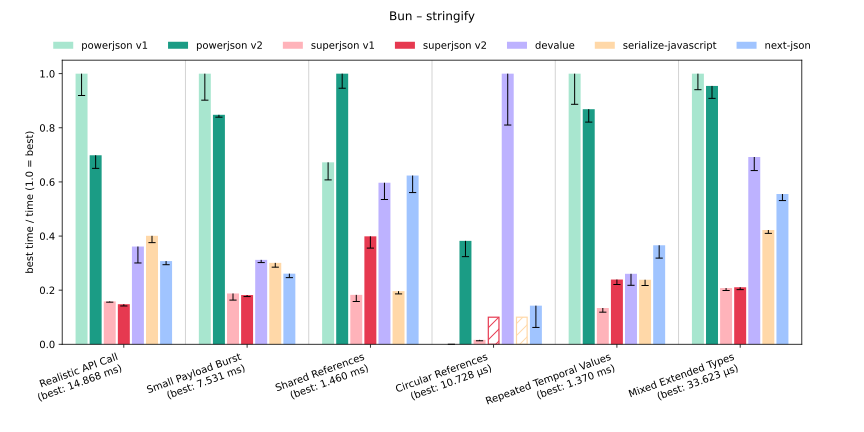
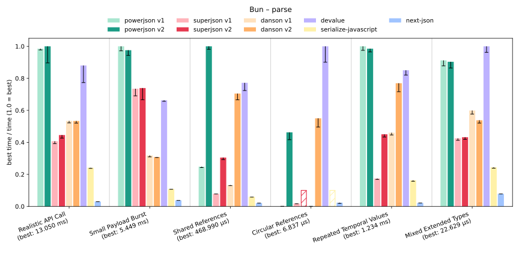
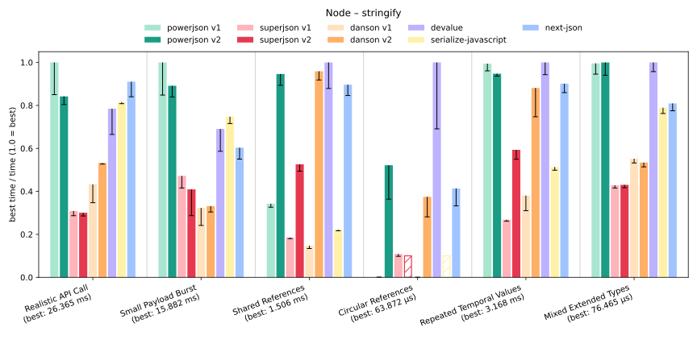
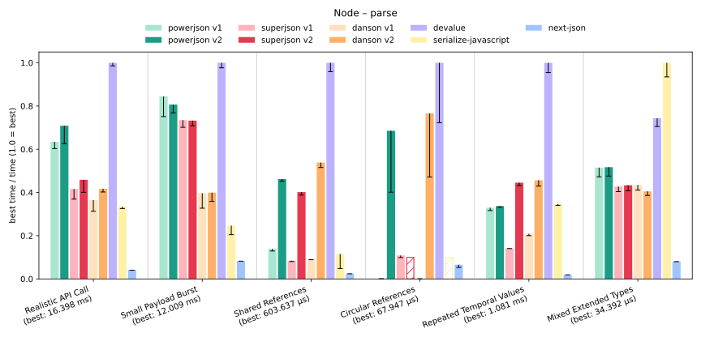
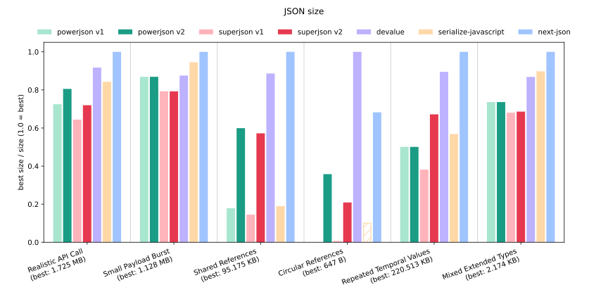

# Benchmarks

In PowerJson, performance is a first-class concern. These benchmarks help us to both track down performance bottlenecks and compare PowerJson to other libraries.

## Scope

We consider the following libraries:

- `powerjson`
    - Both `deduplicate: false` and `deduplicate: true` (marked as v1 and v2 respectively).
- [`superjson`](https://github.com/ravionhq/superjson)
    - Both `dedupe: false` and `dedupe: true` (marked as v1 and v2 respectively).
- [`devalue`](https://github.com/sveltejs/devalue)
- [`serialize-JavaScript`](https://github.com/yahoo/serialize-javascript)
- [`next-json`](https://github.com/iccicci/next-json)

If you know of any other promising libraries, please open an issue or submit a pull request.

There are several benchmark scenarios, each with a different focus. Check out the [benchmarks/scenarios/](../benchmarks/scenarios/) directory for the complete list. We try to cover both realistic scenarios and synthetic edge cases. However, we obviously can't cover everything, so if you have any scenario worth benchmarking, please open an issue or submit a pull request.

## Running the benchmarks

You can run the basic version with:

```sh
bun run --expose-gc benchmarks/index.ts
node --expose-gc benchmarks/index.ts
```

For better results, benchmarks try to use `nice` to increase the process priority. This usually requires either root privileges or editing `/etc/security/limits.conf`. Also, `taskset` is used to pin the process to a single logical CPU. Use `BENCHMARK_CPU` to override the default CPU selection (e.g., if you want to run multiple benchmarks in parallel). Combined together:

```sh
sudo BENCHMARK_CPU=0 bun run --expose-gc benchmarks/index.ts
sudo BENCHMARK_CPU=2 node --expose-gc benchmarks/index.ts
```

Crucially, check your CPU's topology before assigning logical CPUs (e.g., using `lscpu -e`). For example, [our CPU](#configuration) assigns both 0 and 1 to the same physical core, which is why we use 0 and 2 instead. Additionally, some physical cores are more powerful than others, so run the benchmarks on cores of the same quality.

Benchmark inputs are deterministic through the seed and reference date in `benchmarks/config.ts`. There you can adjust `BENCHMARK_ITERATIONS_SCALE` to increase the sample size when investigating performance; use values of at least `1` for meaningful comparisons. Avoid treating an individual benchmark run as conclusive because runtime noise can affect results.

## Configuration

- kernel: 7.1.4-arch1-1
- CPU: 13th Gen Intel i9-13900HX (32) @ 5.200GHz 
- RAM: 64 GB @ 5.600 GHz

| library              | version |
| -------------------- | ------- |
| bun                  | 1.4.0   |
| node                 | 26.8.2  |
| powerjson            | 1.2.2   |
| superjson            | 2.2.6   |
| devalue              | 5.9.1   |
| next-json            | 0.5.1   |
| serialize-javascript | 7.1.0   |

## Results

The results are displayed as reciprocal values normalized to 1 (i.e., **higher is better**; the best result is always 1). Whenever a benchmark fails, the result (and subsequent results, i.e., parsing after a failed serialization) is displayed as a white bar with colored hatching and height 0.1. Raw data is available in the [data](./data/) directory.











### Discussion

Both `serialize-javascript` and `next-json` use a custom grammar to extend the JSON format, allowing them to achieve smaller sizes in most scenarios. The price for this is inability to use the built-in `JSON.parse` and `JSON.stringify` functions, which are highly optimized in both Node and Bun, thus resulting in a poor performance. Specifically `next-json` is abysmal for parsing.

`devalue` uses a specific, non-human-readable serialization scheme (that is, however, still a valid JSON). This allows it to achieve the smallest or close-to-smallest sizes in all scenarios, while still being one of the fastest libraries. If you don't care about human-readability or long-term stability of the serialized format, `devalue` is a great choice.

Both `powerjson` and `superjson` are generally OK in terms of size, except for scenarios with a lot of references without deduplication. Specifically, `v1` of both libraries explode in the *Circular References* scenario (which is a very specific case, not commonly encountered in real-world applications). Nevertheless, `v2` fixes this issue. In the end, `powerjson` produces almost everywhere smaller output than `superjson`.

When it comes to speed, `powerjson`, again, outperforms `superjson` in almost every scenario, usually several times over. A much closer match is `powerjson` vs `devalue`, where the latter has an edge in parsing on Node, but `powerjson` is generally faster in other cases.

Another takeaway is that Bun is in most scenarios faster than Node, and in some of them, it's not even close.
